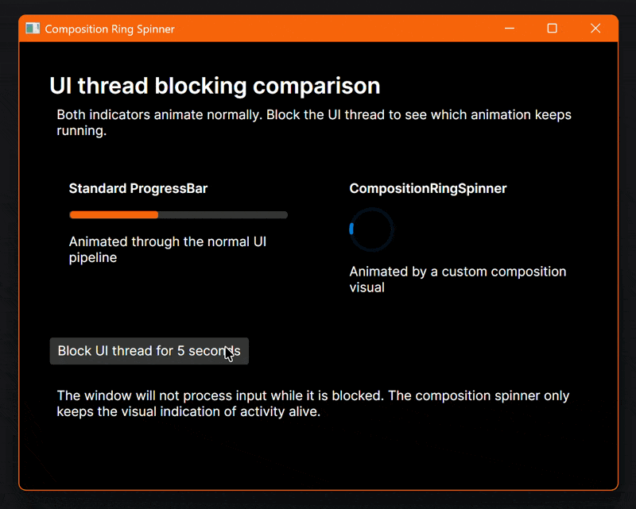

Keeping the UI thread free is always the best option. Unfortunately, there are situations where this is not entirely possible. Here's a small progress spinner which keeps animating when the UI thread is busy.

<!--more-->

## Introduction

Running expensive work on the UI thread is a bad idea. The application stops processing input, layout and rendering until the work is done. Moving the work to a background thread and only dispatching small updates back to the UI thread is usually the right solution.

But sometimes the expensive part actually is UI work. Creating hundreds or thousands of controls, measuring complex layouts or applying many changes to an observable collection all have to happen on the UI thread. The data may have been prepared in the background but the UI thread can still get congested when the controls are created.

One visible side effect is that progress animations become choppy or stop completely. This is especially unfortunate because the progress indicator is supposed to tell the user that the application is still doing something.

For this scenario, I created a `CompositionRingSpinner` which uses Avalonia's composition renderer instead of a regular UI-thread animation.

## Sample

The ready-to-use sample application can be found [here](https://github.com/StefanKoell/Misc/tree/main/src/CompositionRingSpinner). It shows a standard, indeterminate `ProgressBar` and the `CompositionRingSpinner` next to each other.


{ width="800" caption="The ProgressBar stops while the CompositionRingSpinner continues to animate" }

The button deliberately blocks the UI thread for five seconds:

```csharp {linenos=table}
[RelayCommand]
private static void BlockUiThread()
{
    Thread.Sleep(TimeSpan.FromSeconds(5));
}
```

Calling `Thread.Sleep` on the UI thread is obviously not something you should do in a real application. It simply makes the difference between the two controls very easy to see. The standard `ProgressBar` stops while the composition spinner continues to animate.

The relevant [XAML](https://github.com/StefanKoell/Misc/blob/main/src/CompositionRingSpinner/MainWindow.axaml) is quite simple:

```xml {linenos=table}
<ProgressBar Height="8" IsIndeterminate="True" />

<controls:CompositionRingSpinner
    Width="48"
    Height="48"
    ForegroundColor="#0078D4"
    StrokeThickness="4"
    TrackColor="#200078D4" />
```

## Composition Custom Visual

The implementation consists of three small parts:

- [`CompositionRingSpinner`](https://github.com/StefanKoell/Misc/blob/main/src/CompositionRingSpinner/Controls/CompositionRingSpinner.cs) is the Avalonia control used from XAML.
- [`CompositionRingSpinnerVisualState`](https://github.com/StefanKoell/Misc/blob/main/src/CompositionRingSpinner/Controls/CompositionRingSpinnerVisualState.cs) contains the state sent from the control to the composition visual.
- [`CompositionRingSpinnerVisualHandler`](https://github.com/StefanKoell/Misc/blob/main/src/CompositionRingSpinner/Controls/CompositionRingSpinnerVisualHandler.cs) draws and animates the spinner.

The control creates a `CompositionCustomVisual` when it is attached to the visual tree:

```csharp {linenos=table}
var elementVisual = ElementComposition.GetElementVisual(this);
if (elementVisual == null)
    return;

_handler = new CompositionRingSpinnerVisualHandler();
_customVisual = elementVisual.Compositor.CreateCustomVisual(_handler);
ElementComposition.SetElementChildVisual(this, _customVisual);
```

Properties such as `IsActive`, `ForegroundColor`, `TrackColor` and `StrokeThickness` are regular Avalonia styled properties. Whenever one of those values, the bounds or the visibility changes, the control sends a new immutable state message to the custom visual.

The important part happens in the visual handler:

```csharp {linenos=table}
public override void OnAnimationFrameUpdate()
{
    _isAnimationFrameUpdateRegistered = false;

    if (!_isActive)
        return;

    _currentFrame = CompositionNow;
    _firstFrame ??= _currentFrame;
    Invalidate();
    RegisterForNextAnimationFrameUpdateIfNeeded();
}
```

`RegisterForNextAnimationFrameUpdate` schedules the next frame in the composition renderer. The handler calculates the rotation and sweep angle based on `CompositionNow`, invalidates the custom visual and draws the next frame using Skia. It does not have to update an Avalonia property on the UI thread for every frame.

The animation combines a slow rotation of the entire ring with a faster growing and shrinking arc. This gives it a similar appearance to the indeterminate progress indicators used in many desktop applications.

## Stop Work When Hidden

A continuously running composition animation can also waste resources when nobody can see it. The spinner only requests additional frames when all of the following conditions are true:

- `IsActive` is `true`.
- The control and its visual ancestors are visible.
- The control has a non-empty size.

When the control is detached, it sends one final inactive state, removes the child composition visual and disposes the visibility subscriptions. This is important when the control is used in views which are frequently opened and closed.

## Limitations

This control does **not** make the application responsive while the UI thread is blocked. Keyboard and pointer input, normal UI updates and layout still have to wait. It only keeps the visual indication of activity alive.

The preferred solution is still to move expensive work off the UI thread, split UI changes into smaller batches and use an appropriate dispatcher priority. The composition spinner is useful for those remaining cases where some expensive UI work cannot be avoided.

## Conclusion

Avalonia's composition APIs are a great fit for small, high-frequency visuals which should not depend on the UI dispatcher for every frame. A progress spinner is a simple use case but the same technique can also be useful for other lightweight effects.

Of course, a smoothly rotating spinner should never be used to hide a generally unresponsive application. But when a short burst of unavoidable UI work makes the normal progress animation choppy, keeping the busy indicator on the composition renderer provides a much better visual result.

As always, feedback and improvements are welcome.
